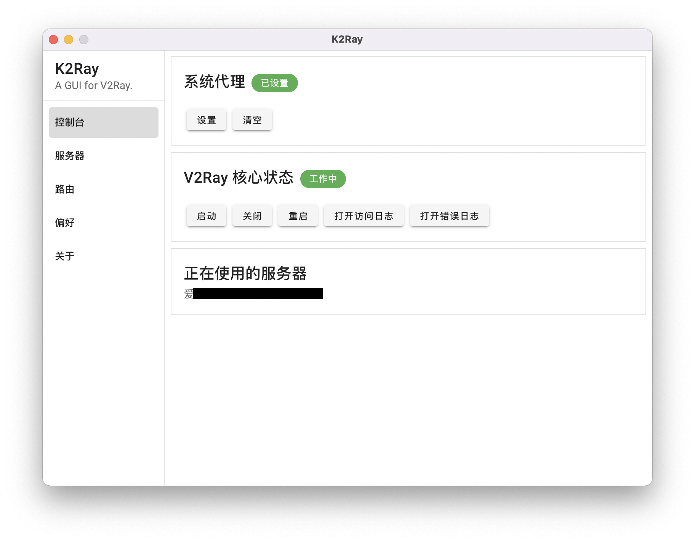
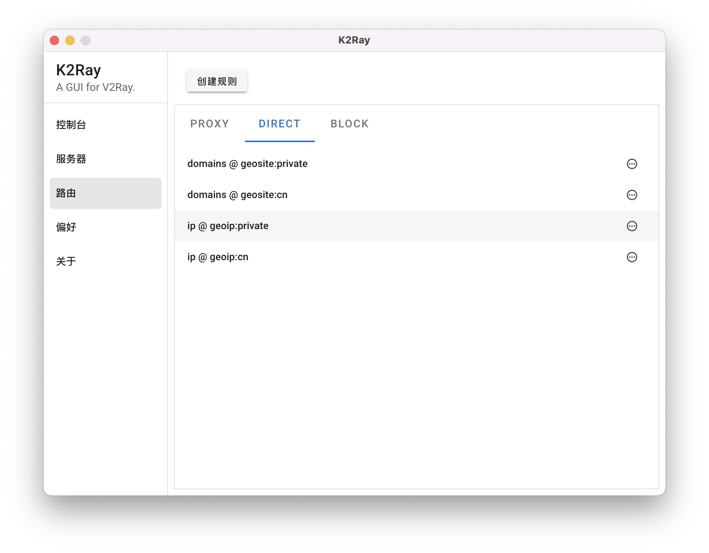
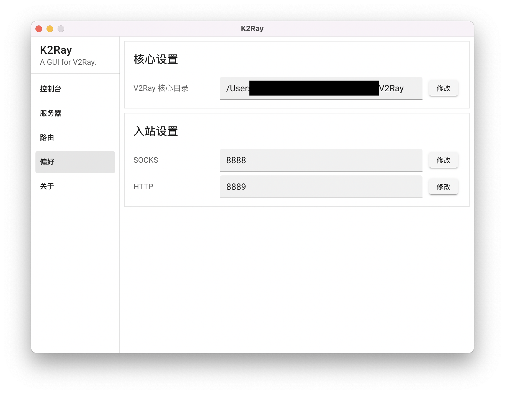

# K2Ray

## Motivation

首先，感谢 [Qv2ray](https://qv2ray.net/) 开发团队的工作，使我在过去很长一段时间内没有发愁过使用何种代理工具。 [V2Ray](https://www.v2fly.org) 是一个非常强大的网络工具， Qv2ray 为其提供了图形界面，极大地提升了可用度。

重装系统时，我发现 Qv2ray 已经停止更新，版本号停留在了 2.7.0 。虽然可以预见在接下来数年内 Qv2ray 加 V2Ray 仍然是一套非常高可用度的工具组合，但是停止更新的软件总是让人焦虑。

然而，在我下载了各种 V2Ray 的图形界面之后，我发现其中很少有给路由功能制作界面的，大部分都是 PAC 。路由功能是我不想舍弃的，于是我用回了 Qv2ray 。最近又重装了系统，又看到了 Qv2ray 停止更新的公告，决定还是学着从命令行直接使用 V2Ray 。用了一段时间发现，太麻烦了，切换个服务器还要打开命令行敲命令。最终，我产生了自己做一个图形界面的想法。

问题在于，我不懂前端。

全剧终。

## Feature

经过我的全力开发， K2Ray 诞生了！它具有以下特点：

- 极高的兼容性，适配了**多达**一台的计算机（就是我的 Mac ）。希望其他使用 Apple Silicon Mac 的用户也可以使用它。
  - 现在也支持 Windows 了。
- 极广的覆盖率，为 V2Ray 的**绝大部分**功能中的一小部分制作了图形界面，主要包括我最喜欢的路由功能。
- 极强的稳定性，没有任何 bug ，因为作者根本没测试。
- 支持各种协议，包括作者的 VPN 使用 Trojan 协议。因为只有一个作者，所以只有一种协议，非常合理。

## Usage

作为一个图形界面， K2Ray 和 Qv2ray 一样，需要另外下载 V2Ray 核心，请到 V2Ray 的 [官网](https://www.v2fly.org) 下载。解压后，把它放在你喜欢的地方。安装 K2Ray 之后，请在偏好中设置 V2Ray 核心的路径，之后就可以使用了。

没有什么教程，因为就那么点功能，两分钟就都探索完了……

### macOS 提示 K2Ray.app 已损坏，无法打开

这可能是因为 macOS 的安全机制，总之，你可以运行如下命令：

``` bash
sudo xattr -r -d com.apple.quarantine /path/to/K2Ray.app
```

请注意把 `/path/to/K2Ray.app` 替换为实际的路径，一般来说是 `/Applications/K2Ray.app` 。

## Screenshot









