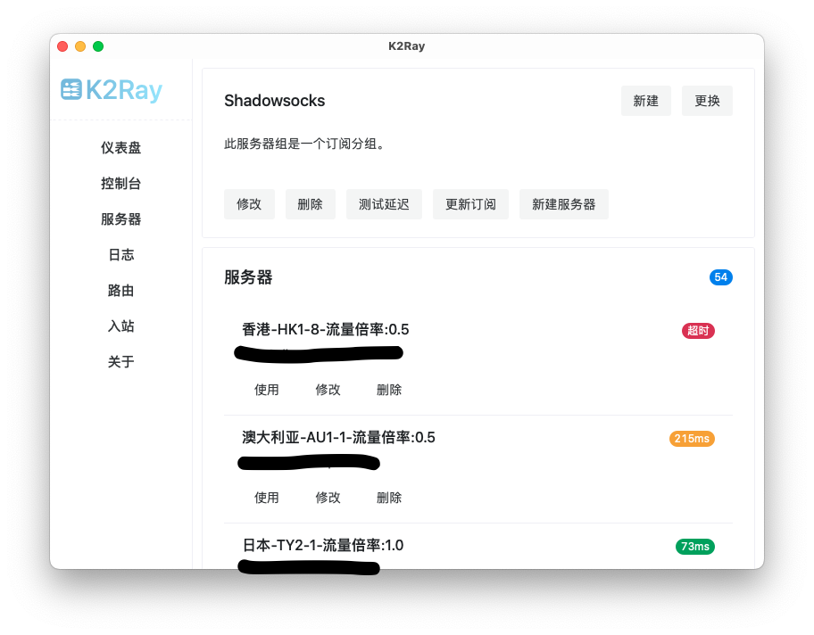

# K2Ray

## Motivation

首先，感谢 [Qv2ray](https://qv2ray.net/) 开发团队的工作，使我在过去很长一段时间内没有发愁过使用何种代理工具。 [V2Ray](https://www.v2fly.org) 是一个非常强大的网络工具， Qv2ray 为其提供了图形界面，极大地提升了可用度。

重装系统时，我发现 Qv2ray 已经停止更新，版本号停留在了 2.7.0 。虽然可以预见在接下来数年内 Qv2ray 加 V2Ray 仍然是一套非常高可用度的工具组合，但是停止更新的软件总是让人焦虑。

然而，在我下载了各种 V2Ray 的图形界面之后，我发现其中很少有给路由功能制作界面的，大部分都是 PAC 。路由功能是我不想舍弃的，于是我用回了 Qv2ray 。最近又重装了系统，又看到了 Qv2ray 停止更新的公告，决定还是学着从命令行直接使用 V2Ray 。用了一段时间发现，太麻烦了，切换个服务器还要打开命令行敲命令。最终，我产生了自己做一个图形界面的想法。

问题在于，我不懂前端。

全剧终。

## Feature

目前支持 macOS arm 和 Windows x64 。支持以下功能：

- 仪表盘：
  - 管理系统代理的状态；
  - 管理 V2Ray 的状态；
- 服务器：
  - 服务器订阅；
  - 检测服务器延迟；
  - 当前只支持 Trojan 协议。
    - 如果你知道其他协议的配置定义，那么请提 issue 要求添加。
- 日志：
  - 展示 V2Ray 的访问日志，方便检查某个请求究竟走了哪个出站口；
- 路由：
  - V2Ray 的路由配置。

## Usage

作为一个图形界面， K2Ray 和 Qv2ray 一样，需要另外下载 V2Ray 核心，请到 V2Ray 的 [官网](https://www.v2fly.org) 下载。解压后，把它放在你喜欢的地方。安装 K2Ray 之后，请在控制台中设置 V2Ray 核心的路径，之后就可以使用了。

没有什么教程，因为就那么点功能，两分钟就都探索完了……

### macOS 提示 K2Ray.app 已损坏，无法打开

这可能是因为 macOS 的安全机制，总之，你可以运行如下命令：

``` bash
sudo xattr -r -d com.apple.quarantine /path/to/K2Ray.app
```

请注意把 `/path/to/K2Ray.app` 替换为实际的路径，一般来说是 `/Applications/K2Ray.app` 。

## Screenshot





